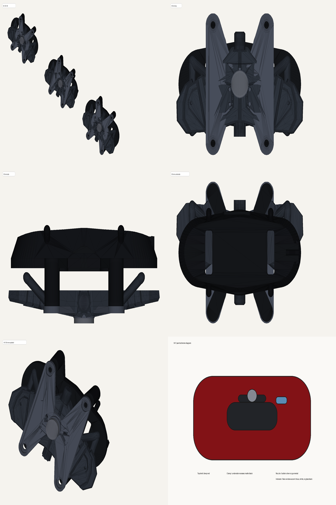
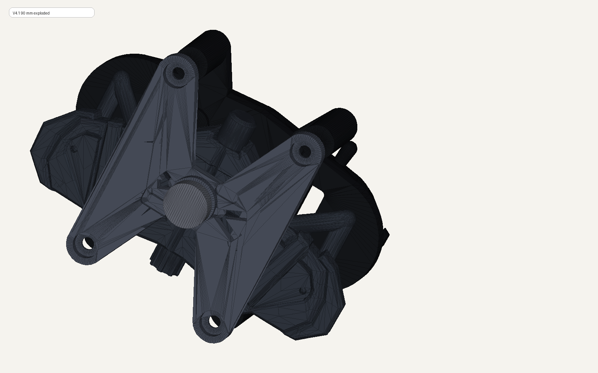
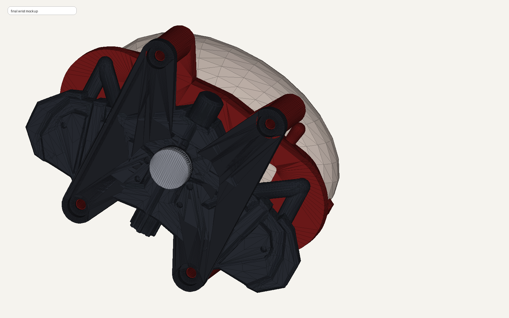

# OpenSCAD Mechanical Prototyping

An OpenSCAD-based prototyping workspace for low-force wearable and bench-top mechanism experiments, with printability constraints, schematic preview sheets, and iteration notes.

This repo is public on purpose for one reason: it shows real engineering iteration instead of vague "I build hardware too" claims.

## Scope

This project has two tracks:

- a compact bench-top mechanism prototype for fit and motion testing
- a wearable shell track inspired by cinematic wrist-device aesthetics, rebuilt as a safer cosplay / prototype enclosure

## Included Here

- simplified preview sheets for the wearable-shell direction
- selected OpenSCAD source files for the bench mechanism track
- engineering constraints
- iteration notes and review notes
- lessons learned from tolerance and printability work

I am not publishing the full wearable-shell source dependency chain here because the public version should stay clean, reproducible, and free of questionable source-asset baggage.

## Safety Constraints

These builds were developed under strict constraints:

- no compressed air
- no hard projectile
- no sharp tip
- no grappling or body-weight use
- only low-force safe cosplay-style testing

If a design direction violates those rules, it is out.

## How To Use It

1. Open `openscad/bench_mechanism_v3.scad` or `openscad/bench_mechanism_v3_render_scene.scad` in OpenSCAD.
2. Review the constraints and lessons in `docs/` before changing geometry.
3. Export only after checking clearances with separate fit coupons and a slicer preview.

## Evidence From The Current Iteration

The public evidence is deliberately small: one overview, one assembly view, and one wrist-scale mockup.

<p>
  
</p>

<details>
<summary>Inspect the assembly and intended form factor</summary>

<p>
  
</p>

<p>
  
</p>
</details>

Other available preview assets:

- [final_preview_sheet.svg](./renders/final_preview_sheet.svg)
- [cosmetic_shell_v2_1_preview_sheet.svg](./renders/cosmetic_shell_v2_1_preview_sheet.svg)

## Repo Structure

```text
openscad-mechanical-prototyping/
├── README.md
├── docs/
│   ├── ai-workflow.md
│   ├── constraints.md
│   └── lessons-learned.md
├── openscad/
│   ├── bench_mechanism_v3.scad
│   └── bench_mechanism_v3_render_scene.scad
└── renders/
    ├── cosmetic_shell_v2_1_preview_sheet.svg
    ├── final_exploded_view.png
    ├── final_preview_sheet.png
    ├── final_preview_sheet.svg
    └── final_solid_wrist_mockup.png
```

## Limitations

- The public source is intentionally limited to the bench-mechanism track.
- The wearable-shell track is described here, but not fully published.
- This repo documents prototyping work, not a finished product or a safety-certified mechanism.

## Reproduce A Check

There is no trustworthy geometry test without OpenSCAD and a slicer. The repeatable review loop is:

1. Open the source with `part = 1`, `2`, or `3` selected.
2. Render the selected part and export STL.
3. Confirm manifold status, dimensions, and clearances in a slicer.
4. Print the smallest fit coupon before printing the full mechanism.

## What I Learned

- printability is a design constraint, not an afterthought
- zero-clearance thinking is fake progress
- visible mounting that actually works is better than hidden mounting that is imaginary
- fit coupons save money because they fail cheaply
- a prototype is only credible when the failure modes are written down honestly

## Quick Links

- Constraints: [docs/constraints.md](./docs/constraints.md)
- Development note: [docs/ai-workflow.md](./docs/ai-workflow.md)
- Lessons learned: [docs/lessons-learned.md](./docs/lessons-learned.md)
